# DebianAula

Automated build scripts for **DebianAula**, a customized Debian Live KDE Plasma
ISO tailored for classroom/lab use (originally built for courses at UFSC).

The scripts take the official [Debian Live KDE](https://cdimage.debian.org/debian-cd/current-live/amd64/iso-hybrid/)
image and, fully unattended (aside from two short interactive checkpoints),
produce a ready-to-boot ISO with a curated set of applications, sane defaults,
and a pre-configured desktop environment — so students get a consistent,
distraction-free environment out of the box.

> **Download**: a pre-built ISO is available on the
> [Internet Archive](https://archive.org/details/DebianAula)
> ([direct download](https://archive.org/download/DebianAula/DebianAula.iso))
> — no build required. This pre-built image was generated with the
> **pt_BR / ABNT2 / America/Sao_Paulo** options and its own set of manual
> Desktop Environment tweaks made during the interactive step — it does
> **not** reflect the `en_US` / `br` / no-timezone defaults described below.
> Want a different language/keyboard/timezone, or to audit exactly what
> goes into the image? Build it yourself — see [Installation](#installation).

> [!WARNING]
> **Run `build-iso.sh` inside a VM, never on bare metal.** The build uses
> `chroot`, which does **not** fully isolate the build from your real
> machine — see [Run the build inside a VM](#run-the-build-inside-a-vm-required)
> for why, and for a real incident this caused.

## What you get

- **Live-only or live + installer**: choose at build time whether Calamares
  (with `calamares-settings-debian`, partitioning tools, GRUB, etc.) ships in
  the ISO, or whether it's stripped out for a smaller, install-free USB image.
- **Curated app set**: Firefox (Mozilla repo), VS Code, Neovim configured with
  [LazyVim](https://github.com/wyllianbs/LazyVim-Setup), Kate with
  [kate-quickrun](https://github.com/wyllianbs/kate-quickrun), Thonny, LibreOffice
  (only the language pack you chose at build time, to keep the image lean),
  Konsole with Catppuccin color schemes, VLC, Audacity/Audacious, and more.
- **Sane KDE Plasma defaults, applied without user interaction**:
  - Taskbar with Konsole pinned, Discover not cluttering it
  - Kickoff menu favorites curated (browser, file manager, terminal, editors)
  - Digital clock with seconds and long date format
  - Notification area with the relevant items always visible
  - Desktop folder correctly pointed at `~/Desktop` (not `$HOME`)
  - Slideshow wallpaper (60 min, random)
  - Keyboard layout, system-wide (default: ABNT2/`br`, configurable at build time)
  - Screen lock disabled, Bluetooth disabled
  - Custom splash screen
- **Firefox configured via `policies.json`** (not by shipping a live browser
  profile, which would leak history/cookies/passwords into the image):
  extensions (uBlock Origin, Cookie Manager), homepage, "always ask where to
  save downloads", private browsing by default, password manager disabled,
  and a curated search engine list.
- **Bilingual build tooling**: `build-iso.sh` prints its prompts and progress
  messages in Portuguese or English, auto-detected from the host's `$LANG`.
  This is independent from the generated ISO's own system language, which
  you choose separately during the build (see below) — English by default.
- **Configurable ISO language, keyboard, and timezone**: pick the live
  system's language (`en_US`, `pt_BR`, `es_ES`, `fr_FR`, `de_DE`, `it_IT`),
  keyboard layout (`br`, `us`, `es`, `fr`, `de`, `it`), and timezone at build
  time. Defaults to English / ABNT2 (`br`) / `America/Sao_Paulo` if you just
  press Enter.
- **A disk-space reservation trick**: a 1GB placeholder file is created during
  the build and removed by an init script on first real boot, guaranteeing
  that much free space on the live overlay regardless of the target media.

## Files

| File | Purpose |
|---|---|
| `build-iso.sh` | Main entry point. Downloads/reuses the base Debian Live ISO, extracts it, chroots in to install packages and apply system-wide configuration, runs the interactive customization step, then repacks the final ISO. |
| `stop-build.sh` | Emergency stop — run from a second terminal if the build gets stuck and `Ctrl+C` doesn't work (see [If the build gets stuck](#if-the-build-gets-stuck)). |
| `customize-skel.sh` | Copies `skel/` into the chroot's `/etc/skel`, so the live user's home directory is pre-populated the moment it's created by `adduser` — no manual setup needed. Also patches the keyboard layout and language into the copied config (KDE's `kxkbrc`, `user-dirs.locale`, Thonny) to match the choices made in `build-iso.sh`. |
| `customize-home.sh` | Runs automatically (as the live user, before the interactive step) to install things that need real commands rather than static config files: npm globals, LazyVim, kate-quickrun (always fetching the *latest* GitHub release), conky. |
| `skel/` | The actual dotfiles/config template applied to every new build: Dolphin, Konsole (+ Catppuccin color schemes), Kate, KDE global settings (theme, panel, keyboard, screen lock, splash, wallpaper), VS Code, Thonny. Edit files here directly to change what ships by default — no need to touch `build-iso.sh`. |

## Installation

### Run the build inside a VM (required)

**Run `build-iso.sh` on a disposable VM, not on your real machine.** This
isn't generic caution — it happened: an interrupted `install`-mode build
once left the *real host's* UEFI boot order changed (Windows became the
first entry instead of Debian), and Wi-Fi/audio got toggled off on the
host mid-build, from a run that was never supposed to touch anything
outside the build directory.

**Why this can happen at all:** the build uses `chroot` to configure the
target filesystem, and `chroot` only changes what a process sees as `/` —
it does **not** give the process its own process list, device tree, or
D-Bus/systemd session. Concretely:

- `/proc` is bind-mounted from the host, so the chroot shares the host's
  **process table**. A package's maintainer script calling `pkill`/`killall`
  by process name (common for reloading audio/network daemons) can match
  and kill the *host's* real process of the same name, not just the one
  inside the build.
- `/sys` reflects the **same live kernel/hardware state** everywhere it's
  mounted — that's how sysfs works, it isn't namespaced by mount alone.
  Something writing to e.g. `/sys/class/rfkill/*/state` from inside the
  chroot (a Bluetooth/Wi-Fi widget in the interactive desktop step, for
  example) toggles the *real* radio on your machine.
- Earlier versions of this script additionally bind-mounted `/dev` and
  `/run` wholesale, exposing the host's **real disks** and its **real
  D-Bus/systemd session** inside the chroot — installing `grub-efi`/
  `os-prober` (only in the live + installer mode) in that state is what
  actually rewrote the host's UEFI NVRAM. `build-iso.sh` no longer does
  this (`/dev` is now a minimal synthetic set, `/run` a private tmpfs,
  and `grub-install`/`update-grub`/`os-prober` are diverted to no-ops for
  the duration of the chroot), which closes the specific incident above.

That fix closes the vectors we found, but it's not a hard guarantee — the
`/proc` and `/sys` sharing described above is inherent to how `chroot`
works and can't be fully closed without much heavier isolation (separate
PID/network namespaces, or a real container runtime) that this project
doesn't implement. **A VM is the only guarantee that nothing this script
does — including anything not yet discovered — can reach your real
hardware.** Worst case inside a VM: you revert a snapshot or discard the
disk image. See [Testing the ISO](#testing-the-iso) below for QEMU setup;
the same VM works for running the build itself, not just for booting the
resulting ISO.

### Prerequisites

The build must run on a **Debian-based VM with KDE Plasma** that has:

- A **real TTY** — not a background process or CI runner. The build pauses
  for interactive input more than once.
- **`sudo`** configured for your user.
- An **X server running**, with `DISPLAY` set (i.e. you're in a graphical
  session).
- **Internet access** — the build downloads the base Debian Live ISO (if not
  already present) and installs/updates a large number of packages.
- **`git`** installed, to clone this repository:

  ```bash
  sudo apt-get update
  sudo apt-get install -y git
  ```

  Everything else `build-iso.sh` needs on the host (`xorriso`,
  `squashfs-tools`, `syslinux`, `xserver-xephyr`, etc.) is installed
  automatically as part of the build.

- Enough free disk space for a Debian Live ISO build: the base ISO (~4GB),
  the extracted squashfs (~5-6GB), and the final ISO (~4-6GB) coexist during
  the build — budget at least **20GB free**.

### Clone and run

```bash
git clone https://github.com/wyllianbs/DebianAula.git
cd DebianAula
bash build-iso.sh
```

(The scripts are already marked executable in the repository, so no `chmod`
is needed — `bash build-iso.sh` is enough.)

You'll be asked for:
1. The live user's **username** and **password**.
2. Whether the ISO should be **live-only** or **live + installer**.
3. The **output ISO filename** (default: `DebianAula.iso`, or
   `DebianAulaInstall.iso` if you chose live + installer).
4. The ISO's **system language** (default: English).
5. The **keyboard layout** (default: ABNT2/`br`).
6. The **timezone** (default: `America/Sao_Paulo`).

The build then runs mostly unattended. It pauses twice for interaction:

- **Full-rebuild confirmation** (only if a previous build's `iso/`/`squashfs-root/`
  already exist — won't happen on a fresh clone) — decide whether to start
  fresh or reuse what's there.
- **Interactive desktop session**: a nested X server (Xephyr) opens a nearly-
  complete desktop, isolated from your real session, where you can make any
  additional manual tweaks (Dolphin view mode, Konsole toolbar, etc.) before
  the ISO is finalized. Close the apps you opened normally, then close the
  Xephyr window (or type `exit`) to resume the automated build.

### If the build gets stuck

`Ctrl+C` in the build's terminal doesn't always stop it cleanly — if your
`sudo` uses `use_pty` (a common security default), the commands it runs
(`apt-get`, `mksquashfs`, the chroot itself) end up in a separate
session/pty that never receives that terminal's `SIGINT`. From a
**second** terminal, in the same directory, run:

```bash
bash stop-build.sh
```

This kills everything running inside the chroot, tears down the isolated
`/proc`/`/sys`/`/dev`/`/run` mounts `build-iso.sh` sets up (never anything
belonging to the host — see [Run the build inside a VM](#run-the-build-inside-a-vm-required)
for why those are isolated in the first place), and leaves `squashfs-root`/
`iso` in a resumable state. Running `bash build-iso.sh` again afterwards
picks up where it left off.

The finished ISO is written to the repository directory under the filename
you chose at step 3 (`DebianAula.iso`/`DebianAulaInstall.iso` by default,
depending on the mode from step 2 — so a Calamares-capable build is never
confused with a plain live one already on disk).
A full build (fresh clone, nothing cached) typically takes a while — expect
it to run for an hour or more, mostly unattended, depending on your internet
connection and hardware.

### Testing the ISO

Boot it in a VM before writing it to a real USB drive. QEMU commands are
given below per host OS. Two ways to boot:

- **Live session only** — boots straight off the ISO, RAM-based, nothing
  written to disk. Anything you do is lost when the VM shuts down. Good
  for a quick sanity check.
- **With a virtual disk, installed via Calamares** — for persistent
  changes, attach a `qcow2` disk alongside the ISO. This requires having
  built with the **live + installer** option (`[2]` at the ISO-mode
  prompt): boot the VM, run Calamares, and install onto that virtual
  disk. From then on, boot with just `-hda` (drop `-cdrom`/`-boot d`) to
  start the real installed system — that copy is persistent. Attaching
  the disk without actually installing onto it does **not** persist
  anything (Debian Live's squashfs still runs from RAM either way).

#### Linux

```bash
# Live session only, no persistence
qemu-system-x86_64 \
    -enable-kvm -cpu host \
    -m 8G -vga virtio -usb \
    -device intel-hda -device hda-duplex \
    -drive format=raw,file=DebianAula.iso
```

```bash
# With a virtual disk, to test the Calamares installer (build with the
# live + installer option, e.g. saved as DebianAulaInstall.iso)
qemu-img create -f qcow2 DebianAula.qcow2 50G
qemu-system-x86_64 \
    -enable-kvm -cpu host \
    -m 8G -vga virtio -usb \
    -device intel-hda -device hda-duplex \
    -hda DebianAula.qcow2 -cdrom DebianAulaInstall.iso -boot d
```

Once Calamares finishes installing onto `DebianAula.qcow2`, boot that same
disk **without** the ISO attached (drop `-cdrom`/`-boot d`) to start the
real installed system — from here on, everything you do is written to
`DebianAula.qcow2` and persists across reboots, like any normal install:

```bash
qemu-system-x86_64 \
    -enable-kvm -cpu host \
    -m 8G -vga virtio -usb \
    -device intel-hda -device hda-duplex \
    -hda DebianAula.qcow2
```

Or write the ISO to a USB drive directly (⚠️ this overwrites the target
device — double-check `/dev/sdX`):

```bash
sudo dd if=DebianAula.iso of=/dev/sdX bs=4M status=progress oflag=sync
```

#### Windows

Requires [QEMU for Windows](https://www.qemu.org/download/#windows) and
Hyper-V/WHPX enabled (`-accel whpx` — KVM is Linux-only). Run from
PowerShell or cmd in the folder with the ISO. Same two options as Linux,
just with `-accel whpx` instead of `-enable-kvm`:

```bat
:: Live session only, no persistence
qemu-system-x86_64 -accel whpx -cpu host -m 8G -vga virtio -usb ^
    -drive format=raw,file=DebianAula.iso
```

```bat
:: With a virtual disk, to test the Calamares installer (DebianAulaInstall.iso)
qemu-img create -f qcow2 DebianAula.qcow2 50G
qemu-system-x86_64 -accel whpx -cpu host -m 8G -vga virtio -usb ^
    -hda DebianAula.qcow2 -cdrom DebianAulaInstall.iso -boot d
```

Once Calamares finishes installing, boot `DebianAula.qcow2` **without**
the ISO (drop `-cdrom`/`-boot d`) to start the real installed system —
persistent from here on:

```bat
qemu-system-x86_64 -accel whpx -cpu host -m 8G -vga virtio -usb ^
    -hda DebianAula.qcow2
```

#### macOS

Install QEMU via [Homebrew](https://brew.sh) (`brew install qemu`) and use
`-accel hvf` (Apple's hypervisor framework — KVM/WHPX don't apply here).
Same two options as Linux, just with `-accel hvf` instead of `-enable-kvm`:

```bash
# Live session only, no persistence
qemu-system-x86_64 -accel hvf -cpu host -m 8G -vga virtio -usb \
    -drive format=raw,file=DebianAula.iso
```

```bash
# With a virtual disk, to test the Calamares installer (DebianAulaInstall.iso)
qemu-img create -f qcow2 DebianAula.qcow2 50G
qemu-system-x86_64 -accel hvf -cpu host -m 8G -vga virtio -usb \
    -hda DebianAula.qcow2 -cdrom DebianAulaInstall.iso -boot d
```

Once Calamares finishes installing, boot `DebianAula.qcow2` **without**
the ISO (drop `-cdrom`/`-boot d`) to start the real installed system —
persistent from here on:

```bash
qemu-system-x86_64 -accel hvf -cpu host -m 8G -vga virtio -usb \
    -hda DebianAula.qcow2
```

> On **Apple Silicon (M1/M2/M3/...)** `hvf` only accelerates same-architecture
> code — this ISO is `x86_64`, so QEMU falls back to software emulation
> (TCG) for the CPU instructions and will be noticeably slow. `-cpu host`
> won't work either in that case; drop it (or try `-cpu max`). For a
> smoother experience on Apple Silicon, consider [UTM](https://mac.getutm.app/)
> instead, though it has the same underlying x86-on-ARM emulation cost.

## Screenshots

A full run of `build-iso.sh`, from a fresh clone to a booted ISO tested in
QEMU, on an English-locale host (`en_US`).

### Build process

**1. Interactive prompts.** `git clone` + `bash build-iso.sh`, then the
build-time questions: live username, ISO mode, and the new configurable
ISO language / keyboard / timezone (all left at their defaults here —
`en_US`, `br`, `America/Sao_Paulo`). Notice the prompts themselves print in
English, matching this host's `$LANG` — independent from the `en_US`
chosen for the *generated* ISO.

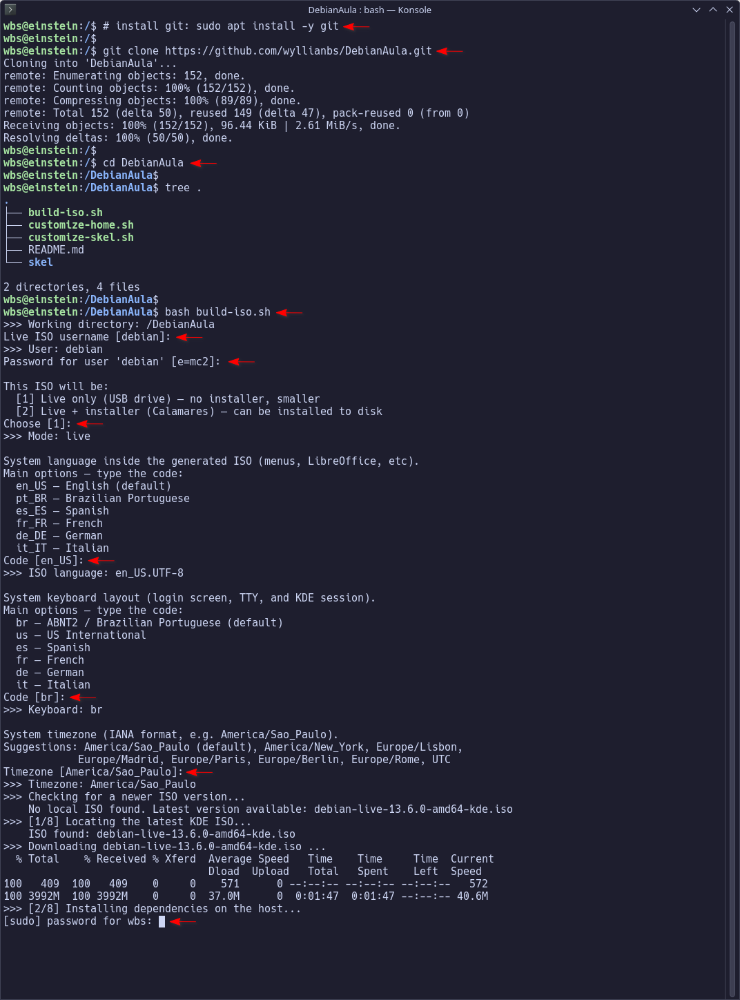

**2. Unattended chroot stage.** Packages installing, `kate-quickrun`
downloaded straight from its latest GitHub release, then the script pauses
right before opening the interactive desktop session.

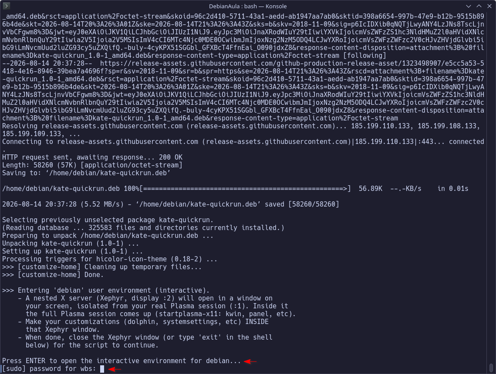

**3. Interactive Xephyr session.** The nested desktop where manual
tweaks happen — isolated from the host's real Plasma session. This is
`neowofetch`'s cow banner inside Konsole, with `conky` already running in
the corner showing system stats.

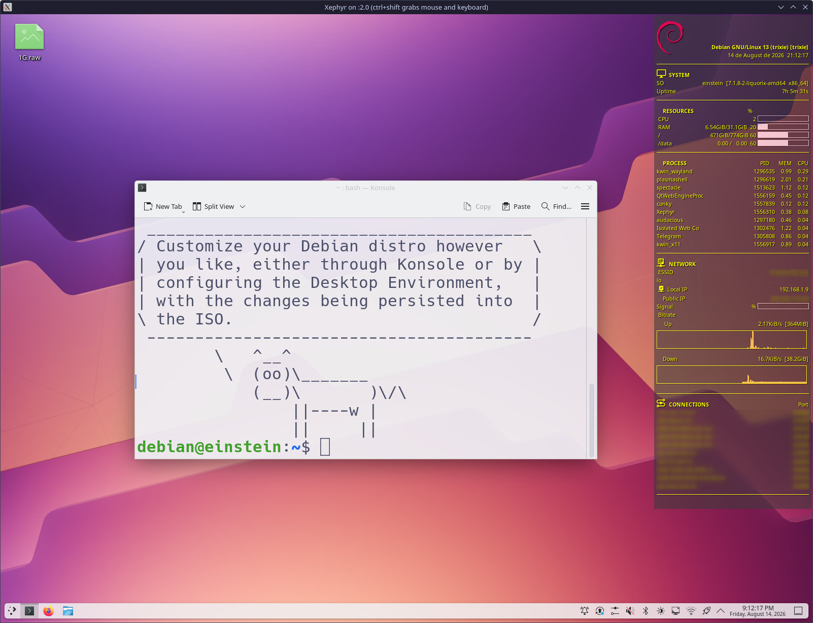

**4. Closing the interactive session.** Typing `exit` in the Xephyr shell
hands control back to `build-iso.sh`, which resumes automation.

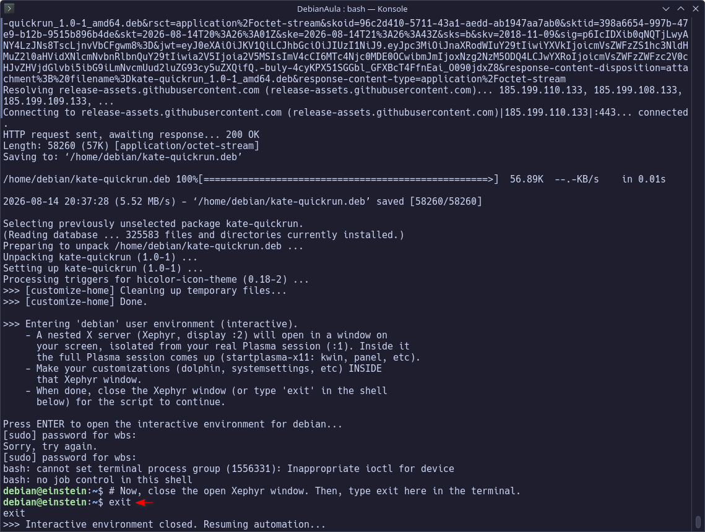

**5. Root finalization + squashfs.** Timezone/cleanup steps run inside the
chroot one last time, then `mksquashfs` packs the filesystem — the slowest
part of the build.

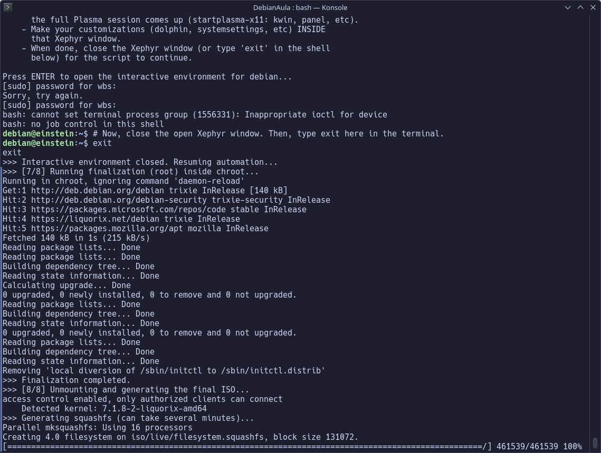

**6. ISO assembly.** `xorriso` writes the final hybrid ISO image; the
build reports the output path and exits.

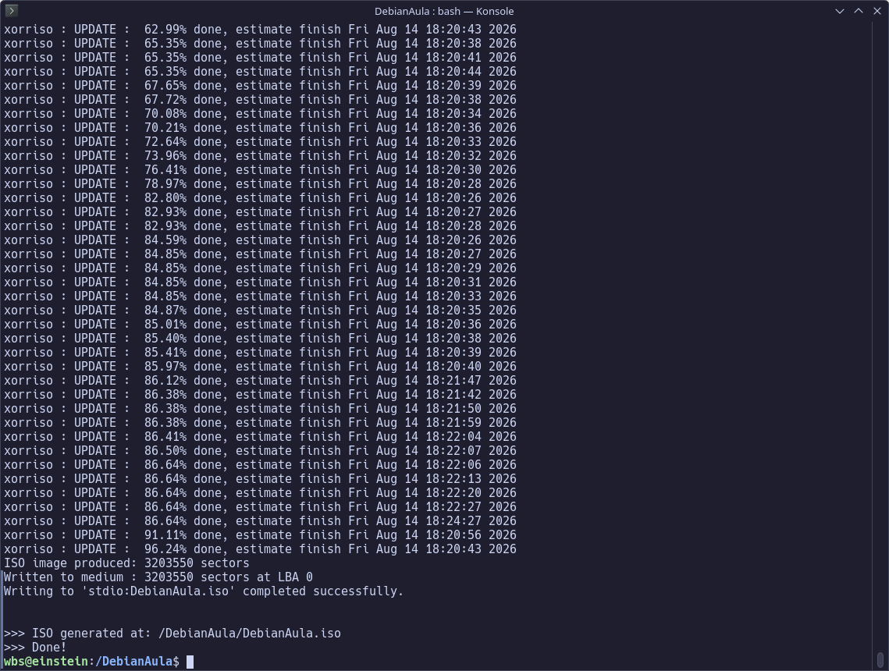

**7. Testing in QEMU.** Booting the freshly built ISO in a VM before
touching a real USB drive, per the [Testing the ISO](#testing-the-iso)
section below.

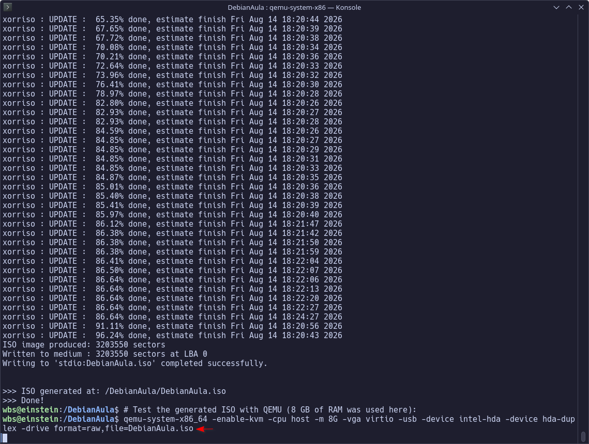

### Booting the result

**8. Boot log.** `live-config` finishing its late-userspace setup — this is
where the live user gets created and the chosen locale/keyboard/timezone
get applied system-wide.

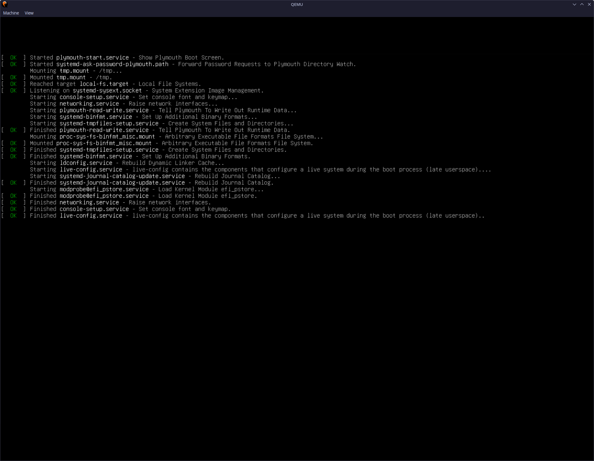

**9. SDDM login.** English UI end-to-end, as chosen at build time, with the
`debian` live user pre-selected.

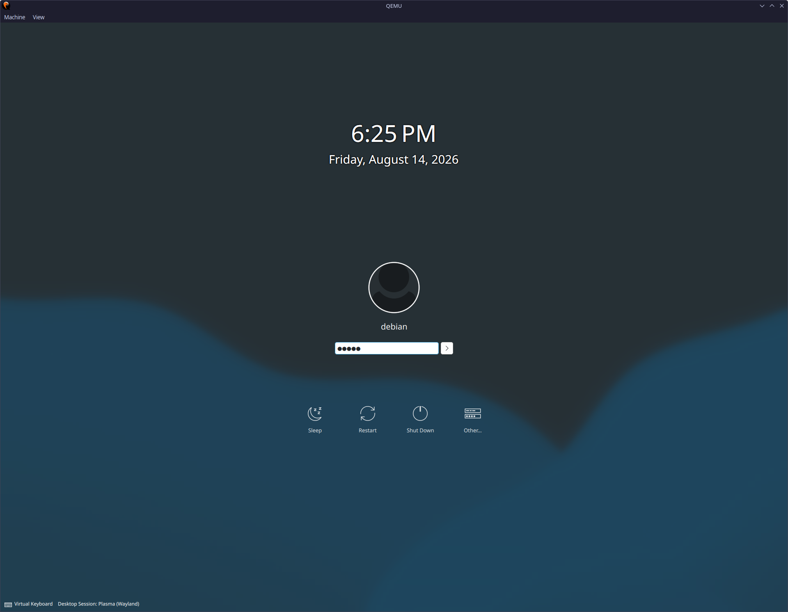

**10. Custom Plymouth splash.** The Debian-branded boot splash configured
in `skel/`/`build-iso.sh`, shown between login and the desktop appearing.

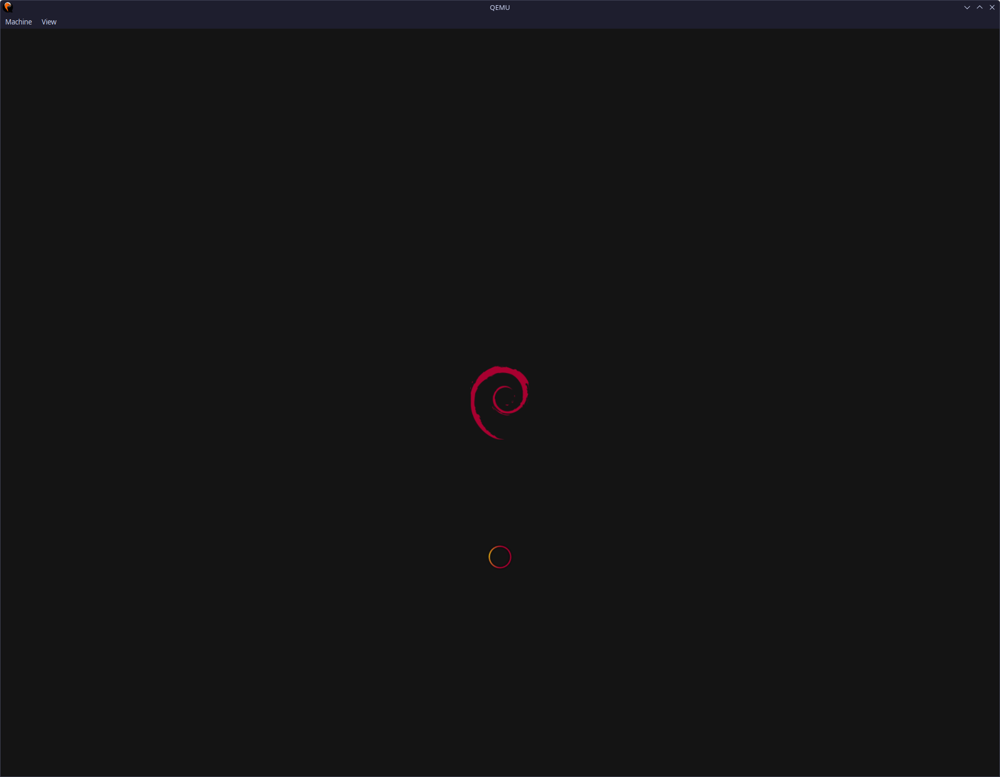

**11. Finished desktop.** Plasma taskbar (launcher, Konsole, Firefox,
Dolphin pinned), default slideshow wallpaper, and `conky` reporting live
system/network stats — all applied automatically via `skel/`, no manual
setup after login.

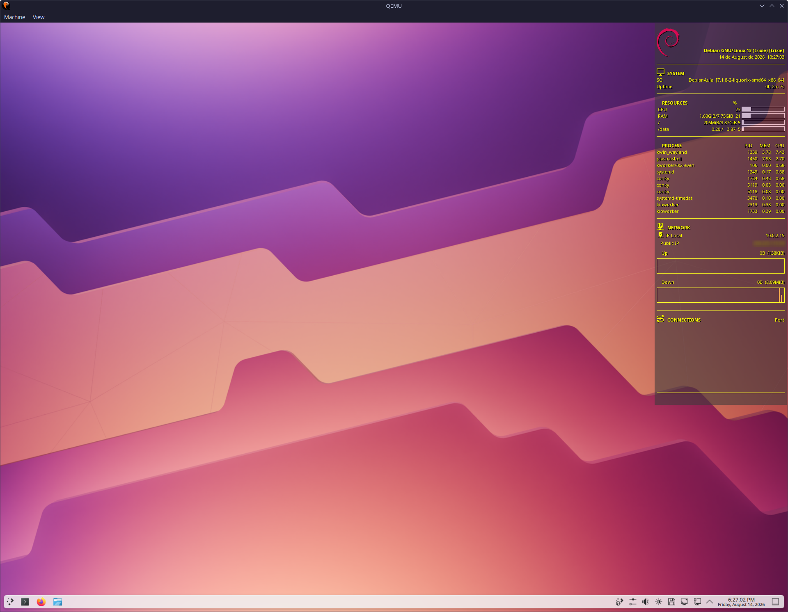

## Customizing further

- **App defaults captured by hand**: some KDE settings (Qt window/toolbar
  state, "use these view properties for all folders", etc.) are only written
  to disk when the relevant app is closed cleanly. Make the change in the
  interactive Xephyr session, close that app's window normally, then copy the
  relevant file(s) from the live user's home directory into `skel/` at the
  same relative path.
- **New packages**: edit the `apt-get install`/`apt-get purge` lists inside
  the `CHROOT_ROOT_SETUP` heredoc in `build-iso.sh`.
- **Firefox policy changes**: edit the `policies.json` heredoc in
  `build-iso.sh` — see [Mozilla's policy reference](https://mozilla.github.io/policy-templates/)
  for available keys.

## License

No license file yet — treat as "all rights reserved" until one is added.
